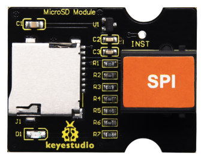
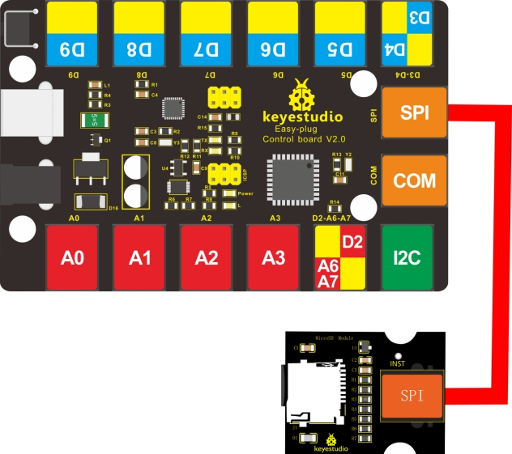
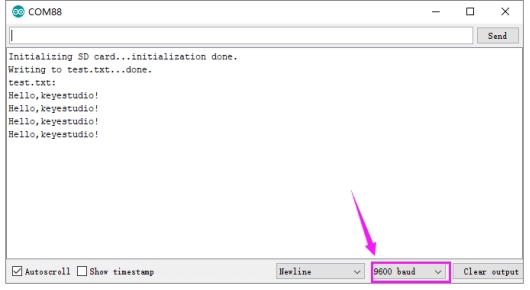

# KS0467 EASY plug micro TF Card Read and Write Module



## 1. Description

The TF card is the most commonly used storage element for interactive media devices.

The EASY plug micro TF card reader module uses SPI communication and can be used to read or write data to the TF card. When using it, we only need to insert the TF card into the module, connect the module to the MCU, and then read and write the TF card through the MCU code.

This module needs to be used with the EASY plug Control board V2.0. When in use, you can use a special telephone line (RJ11 crystal head) to connect with the control board.

Special Note: Need to explain the arduino SD library file, the current support for 2G or more cards is not very good,we recommend to use 2G or less TF card below 2G.

## 2. Technical Parameters

- Working voltage: DC 5V
- Working current: about 10mA
- Maximum power: 0.1W
- Operating temperature range: -25°C to 70°C
- Recommended TF card: maximum 2G
- Size: 39 * 30 * 18mm
- Weight: 6.2g
- Environmental attributes: ROHS

## 3. Wiring Diagram



## 4. Test Code

Download Resource :  [Resource](./Resource.7z)

Note： before uploading the code, you need to import the library files; otherwise, the code upload will fail.

```c
#include <SPI.h>
#include <SD.h>
File myFile;

void setup()
{
  // Open serial communications and wait for port to open:
  Serial.begin(9600);
  while (!Serial) 
  {
    ; // wait for serial port to connect. Needed for Leonardo only
  }
  Serial.print("Initializing SD card...");
  // On the Ethernet Shield, CS is pin 10. It's set as an output by default.
  // Note that even if it's not used as the CS pin, the hardware SS pin
  // (10 on most Arduino boards, 53 on the Mega) must be left as an output
  // or the SD library functions will not work.
  pinMode(10, OUTPUT);
  if (!SD.begin(10)) 
  {
    Serial.println("initialization failed!");
    return;
  }
  Serial.println("initialization done.");
  // open the file. note that only one file can be open at a time,
  // so you have to close this one before opening another.
  myFile = SD.open("test.txt", FILE_WRITE);
  // if the file opened okay, write to it:
  if (myFile) 
  {
    Serial.print("Writing to test.txt...");
    myFile.println("Hello,keyestudio!");
    // close the file:
    myFile.close();
    Serial.println("done.");
  } 
  else 
  {
    // if the file didn't open, print an error:
    Serial.println("error opening test.txt");
  }
  // re-open the file for reading:
  myFile = SD.open("test.txt");
  if (myFile) 
  {
    Serial.println("test.txt:");
    // read from the file until there's nothing else in it:
    while (myFile.available()) 
    {
      Serial.write(myFile.read());
    }
    // close the file:
    myFile.close();
  } 
  else 
  {
    // if the file didn't open, print an error:
    Serial.println("error opening test.txt");
  }
}

void loop()
{
  // nothing happens after setup
}
```

## 5. Test Result

Insert the TF card on the module, upload the test code successfully, after power-on, open the serial monitor of the Arduino IDE and set the baud rate to 9600. Set in the code, we create a TEST.txt file in the TF card, and write "Hello, keyestudio!" in the file, then read the contents of the TEST.txt file and display it on the monitor, as shown below.

